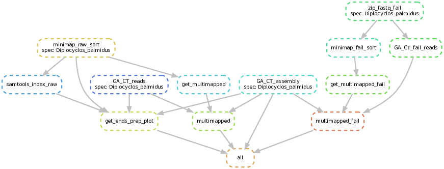

# GA-CT-rich-regions

Workflow to detect assembly regions rich in GA or CT alleles.

### Background

GA/CT simple sequence repeats have been shown to cause a drop in HiFi coverage in the [human genome](https://www.biorxiv.org/content/10.1101/2021.05.26.445798v1) and [tomato genome](https://onlinelibrary.wiley.com/doi/10.1111/tpj.15690). These GA/CT-rich regions can be difficult to assemble, leading to contig breaks. This pipeline aims to detect contigs with problematic regions and gather information to help users link such contig ends together (using multimapped raw reads or HiFi fail reads).

## Workflow structure

- input files: 
	- mandatory: assembly (`.fasta.gz`), HiFi raw reads (`.bam` or `.fastq.gz`)
	- optional: HiFi fail reads (`.bam` or `.fastq.gz`)

- structure of /results folder:
```
Diplocyclos_palmidus/
├── ass_regions_flank.bed
├── contigs_ends.txt
├── contigs_pairs_counts_fail.txt
├── contigs_pairs_counts.txt
├── Diplocyclos_palmidus_GACT_fail_reads.txt
├── GACT_regions_in_assembly.txt
├── mapped_reads
│   ├── Diplocyclos_palmidus_raw_sorted.bam
│   ├── fail_sorted.bam
│   └── raw_sorted.bam
├── multimapped
│   └── Diplocyclos_palmidus_mm_reads_fail.txt
├── multimapped_fail_reads_ends.txt
├── multimapped_raw_reads_ends.txt
└── PLOTS
    └── curves_contigs_ends.pdf
```

- main output files:
	- list of GA/CT regions detected in assembly = `GACT_regions_in_assembly.txt`

```
ContigID	Start	End	Length	Sequence
ptg000001l      10625   10700   75      GGTAGAGAGAGAGAGAGAAAAAAAAAAAAAAAAAAAAAAAAAAAAAAAAAAAAAAGACTATTTTTTTCTGATAAA
ptg000001l      133100  133175  75      TCTCTTTTCTTCTTTCCCCCCCTTTTTTCTTTCTCTCTTCCTTTTCTTCCCATTAACTACAAACATACAAAACCC
ptg000001l      135950  136025  75      GCTTTCTTTCTTTCTTTCTTCTTCTTCATCTTTTTTTTTTTTTTTTTTTTGTGAAAACAAAAGAAAGTTATGATT
ptg000001l      157150  157250  100     TTTTCTTTTTTCTTTTTTCTTTTTTCTTTTTTCTTTTTTCTTTCTTTCTTTATTTCTTTTCTTTTCTTTTCTTTTTTACGAAACACAAATTATGGAAGGG
ptg000001l      644075  644150  75      CTCTCTCTCTCTCTCTCTCTCTCTCTCTCTCTCTCTCTCTTTCTTTCTTTGTGTGAATCTTTCTTTTGGTTCAGA
```
- list of contig ends = `contigs_ends.txt`
```
contigID start end sequence side
ptg000241l 3550 3625 GGGAAGGAGAAGAAAAAAAAAGAGAGAGAAAGAAAAGGAAGAGGAACAAAGAATGACAAACTTAGTGTGCCATAT L
ptg000271l 25 100 CCCCCCCCCCCCCCCCCCCCCCCCCCCTTCCCCCCCCCCCCCCCATCACCCCGTTCTAACAACATACACCCCCCC L
```
- list of contig pairs with number of multimapped reads (potential links) = `contigs_pairs_counts.txt`

```
contigID1 contigID2 count
ptg000003l ptg000012l 1
```

## Repository structure

- `workflow/`: Contains Snakemake pipeline, scripts, environmental modules, and run command.
- `results/`: Directory where the output will be saved.
- `config/`: Contains `config.yaml` to specify cluster environment and `config_path.yaml` to specify input file paths.

## To run follow these steps:
1. Specify your species name, assembly and reads paths in config/config_path.yaml
	- the pipeline will execute any species, which is listed - to disable the species, you can comment the species name
2. Submit workflow/run_Snakefile.sh (for example as `cd workflow; sbatch run_Snakefile.sh` )
	- automatically dag of jobs should be produced in the reports/ directory, but it might need adjustments based on the number of species. The pipeline should sturt running regardless.
3. For troubleshooting, check the pipeline trace in workflow/.snakemake/log and for individual rules the workflow/logs/.


## Toy example

DAG of Snakemake rules:



